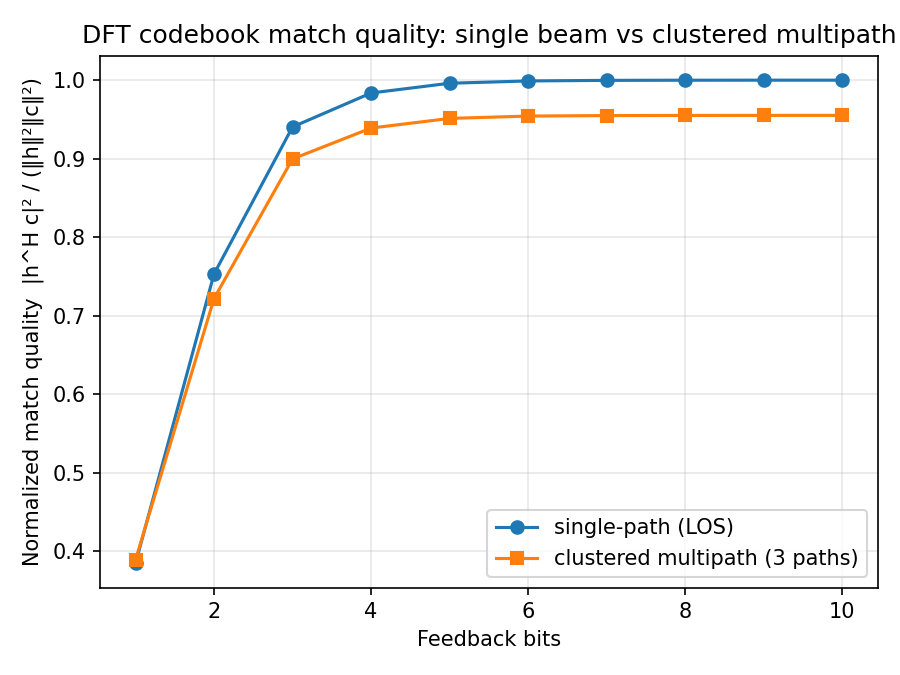
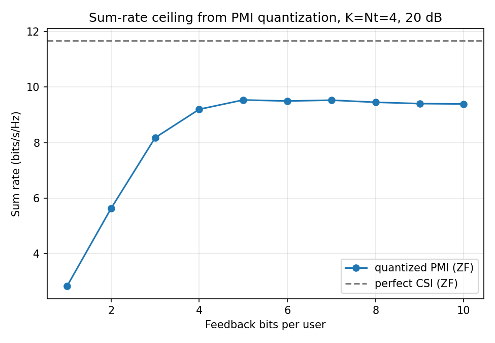
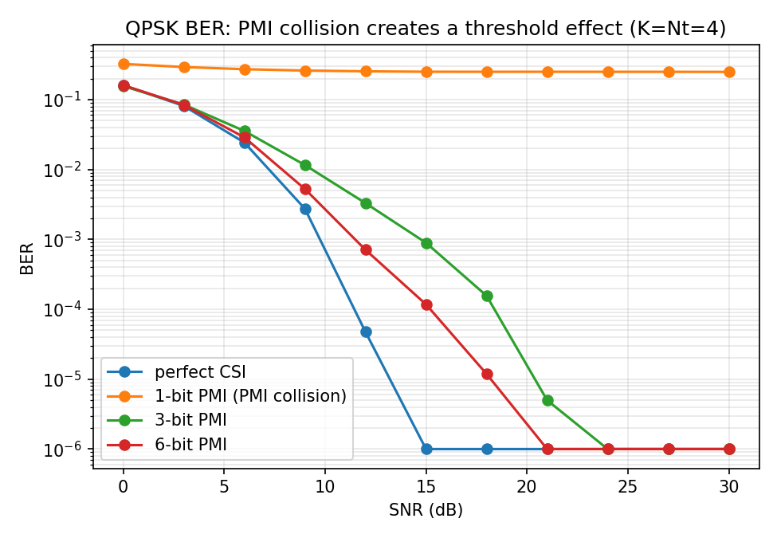
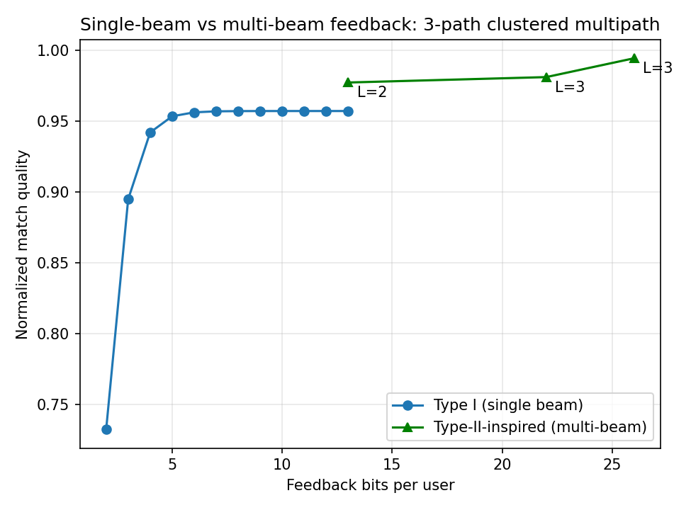

# DFT / Type-II-Inspired Codebook-Based MU-MIMO Precoding over OFDM

Limited-feedback zero-forcing precoding for a MU-MIMO downlink.

Users report a quantized channel direction through a Precoder Matrix Indicator (PMI) instead of full channel state information (CSI). The base station constructs a zero-forcing precoder from those quantized directions, and the experiments evaluate the resulting loss in channel representation quality, sum rate, and BER relative to perfect CSI.

The multi-beam experiment is **Type-II-inspired**, not a complete implementation of the 3GPP Type II codebook. It uses an oversampled DFT beam grid together with quantized amplitude and relative-phase coefficients to study the benefit of representing a multipath channel with more than one beam.

## Features

- Oversampled DFT codebook for PMI feedback
- Geometric clustered-multipath channel model
- Perfect-CSI and quantized-CSI zero-forcing precoding
- QPSK Monte Carlo BER simulation
- Sum-rate evaluation
- PMI collision analysis
- Single-beam vs multi-beam feedback comparison
- Reproducible Monte Carlo experiments

## Repository structure

```text
mu-mimo-codebook-precoding/
├── precoding.py
├── experiments_1_2_3.py
├── experiment_4.py
├── run_all.py
├── requirements.txt
├── README.md
├── BLOG.md
├── LICENSE
├── .gitignore
└── figures/
    ├── experiment_1.png
    ├── experiment_2.png
    ├── experiment_3.png
    └── experiment_4.png
```

### Main files

- `precoding.py` — channel model, DFT codebook, PMI selection, Type-II-inspired multi-beam approximation, ZF precoder, sum-rate calculation, and QPSK BER simulation.
- `experiments_1_2_3.py` — codeword match quality, sum-rate vs feedback bits, and BER / PMI-collision experiments.
- `experiment_4.py` — single-beam vs multi-beam feedback comparison.
- `run_all.py` — runs all experiments and generates the plots.
- `BLOG.md` — technical write-up covering the experiments, implementation reasoning, and debugging process.

## System model

The downlink model for user \(k\) is

```text
y_k = h_k^H x + n_k
```

with

```text
x = Σ_i w_i s_i
```

where:

- `h_k` is the channel vector from the BS antenna array to user `k`
- `w_i` is the precoding vector for user `i`
- `s_i` is the transmitted QPSK symbol
- `n_k` is additive noise

The resulting effective MU-MIMO channel is

```python
G = H.conj() @ W
```

## Channel model

`geometric_channel()` generates a **clustered multipath channel** consisting of `n_paths` propagation paths distributed around one randomly selected angular center.

The experiments use:

```text
Nt = 4 antennas
n_paths = 3
```

representing a **3-path clustered multipath channel**.

## PMI selection

Each user selects the DFT codeword that maximizes the normalized channel-direction match.

The PMI metric is based on the Hermitian inner product

```text
|h^H c|²
```

where `h` is the user's channel vector and `c` is a candidate codeword.

## Zero-forcing precoding

Because the receiver model uses \(h_k^H w\), the ZF precoder is constructed using the conjugated channel matrix:

```python
W = np.linalg.pinv(H.conj())
```

before per-column power normalization.

For perfect CSI this produces an effective channel that is diagonal up to power normalization:

```python
H.conj() @ W
```

which suppresses inter-user interference when the channel matrix has sufficient rank.

## Type-II-inspired multi-beam representation

A single DFT codeword represents only one dominant spatial direction.

The multi-beam model approximates the channel as a weighted combination of multiple selected DFT beams.

The strongest selected beam is used as the reference, and the remaining beam coefficients are represented using:

- quantized amplitude
- quantized relative phase

This allows the feedback representation to capture spatial structure that a single beam cannot represent.

---

# Experiments

## Experiment 1 — Match quality vs feedback bits

The same 400 channel realizations are evaluated at every feedback-bit value.

| Bits | Single-path | 3-path clustered multipath |
|---:|---:|---:|
| 1 | 0.3846 | 0.3891 |
| 2 | 0.7532 | 0.7219 |
| 3 | 0.9404 | 0.8997 |
| 5 | 0.9961 | 0.9513 |
| 10 | 1.0000 | 0.9551 |

The single-path channel converges almost perfectly to one DFT beam as the codebook resolution increases.

The multipath channel instead approaches a match-quality ceiling of approximately **0.955**, showing the structural limitation of representing a multipath spatial channel with only one beam.



---

## Experiment 2 — Sum rate vs feedback bits

Configuration:

```text
K = Nt = 4
SNR = 20 dB
300 channel realizations
```

| Bits/user | Mean sum rate (bits/s/Hz) |
|---:|---:|
| 1 | 2.830 |
| 2 | 5.633 |
| 3 | 8.176 |
| 4 | 9.199 |
| 5 | 9.535 |
| 10 | 9.390 |
| Perfect CSI | 11.665 |

Performance improves rapidly as feedback increases from 1 to approximately 5 bits.

Beyond that point, the single-beam representation remains around **9.4–9.5 bits/s/Hz**, while perfect CSI reaches **11.665 bits/s/Hz**.

Small non-monotonic variations in sum rate can occur because fully-loaded ZF depends on the **joint conditioning of all quantized user channel directions**, rather than only the individual codeword match quality.



---

## Experiment 3 — BER and PMI collision

A fixed, well-conditioned MU-MIMO channel is used to isolate the effect of PMI quantization.

The experiment compares:

- perfect CSI
- 1-bit PMI
- 3-bit PMI
- 6-bit PMI

Perfect-CSI ZF reaches zero observed BER at high SNR.

The 3-bit and 6-bit cases retain the normal BER waterfall behavior and eventually reach zero observed errors in the Monte Carlo simulation.

With only 1-bit feedback, multiple users select the same PMI. This **PMI collision** makes the quantized MU-MIMO channel rank deficient and prevents complete user separation.

The resulting aggregate BER approaches approximately **0.25** at high SNR.

This should not be interpreted as fully random bit guessing, which would correspond to a BER of 0.5.



---

## Experiment 4 — Single-beam vs Type-II-inspired multi-beam feedback

### Channel match quality

| Configuration | Bits/user | Match quality |
|---|---:|---:|
| Type I single beam | 13 | 0.9572 |
| Type-II-inspired, L=2 | 13 | 0.9774 |
| Type-II-inspired, L=3 | 22 | 0.9812 |
| Type-II-inspired, L=3 richer coefficients | 26 | 0.9945 |

At the same **13-bit feedback budget**, the two-beam representation improves channel match quality from

```text
0.9572 → 0.9774
```

### Sum rate at the matched 13-bit budget

| Scheme | Mean sum rate (bits/s/Hz) |
|---|---:|
| Type I, 13 bits | 9.072 |
| Type-II-inspired L=2, 13 bits | 9.467 |
| Perfect CSI | 11.529 |

The multi-beam representation therefore recovers part of the performance lost by the single-beam codebook without increasing the feedback budget.

For additional context, the richer 26-bit multi-beam configuration reaches:

```text
Match quality = 0.9945
Sum rate      = 10.599 bits/s/Hz
```

This result uses a larger feedback budget and is therefore not a direct equal-bit comparison.



---

## Main observations

The experiments highlight three different effects of limited CSI feedback:

1. **Codebook resolution:** increasing PMI bits improves angular resolution rapidly at low feedback budgets.

2. **Representation limitation:** increasing the number of single-beam PMI bits cannot completely represent a multipath spatial channel.

3. **Multi-beam feedback:** using multiple beams with amplitude and relative-phase information improves both channel-direction representation and MU-MIMO sum rate.

They also show that different metrics expose different failure modes:

- **match quality** shows channel representation error
- **sum rate** captures residual MU-MIMO interference continuously
- **BER** clearly exposes catastrophic PMI collision at very coarse feedback resolution

## Running the experiments

Clone the repository and install the dependencies:

```bash
pip install -r requirements.txt
```

Run all experiments:

```bash
python3 run_all.py
```

Generated figures are written to:

```text
figures/
```

## Requirements

- Python 3
- NumPy
- Matplotlib

## Technical write-up

A longer discussion of the implementation decisions, debugging process, and interpretation of the results is available in [`BLOG.md`](BLOG.md).

## License

This project is released under the MIT License. See [`LICENSE`](LICENSE).

